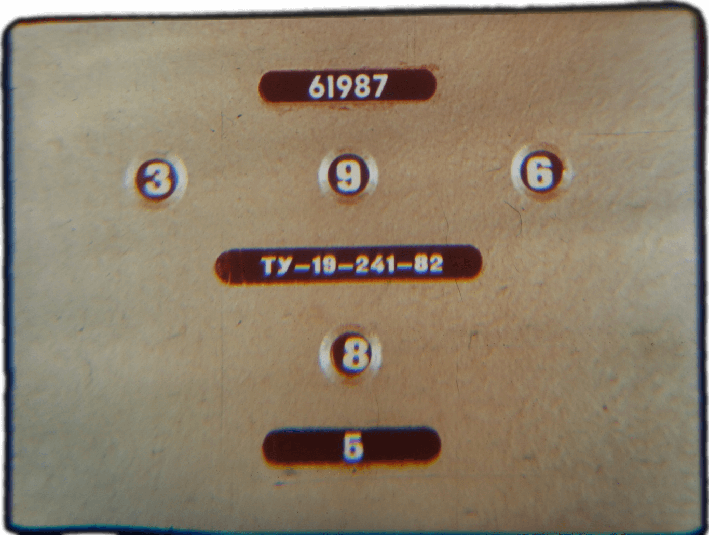
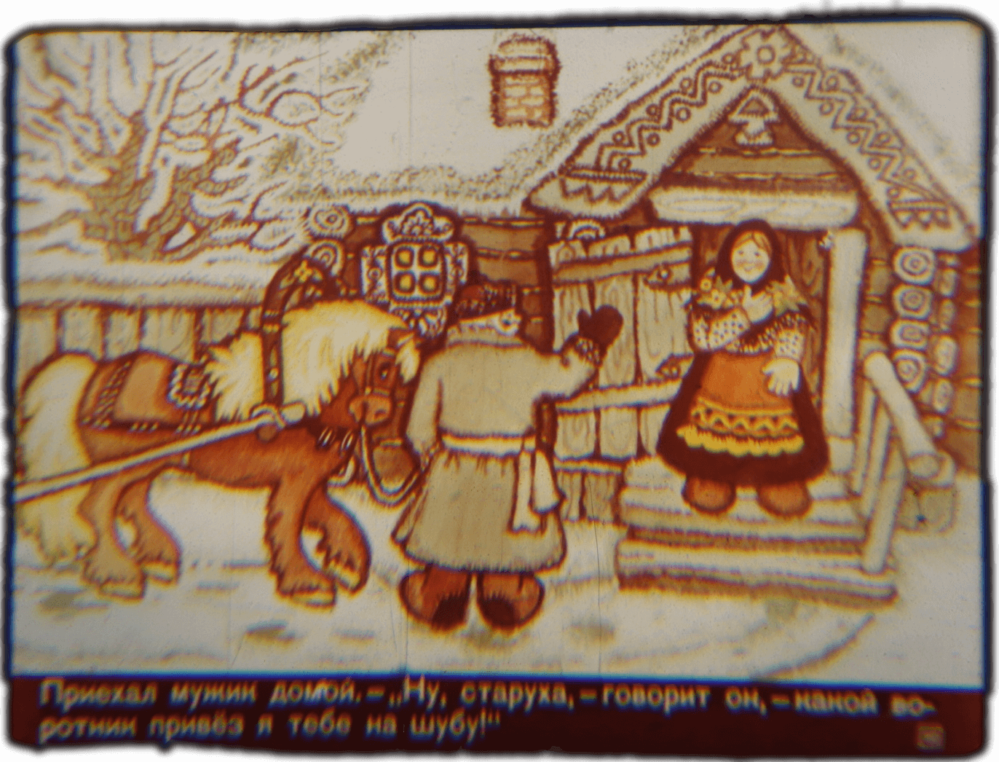
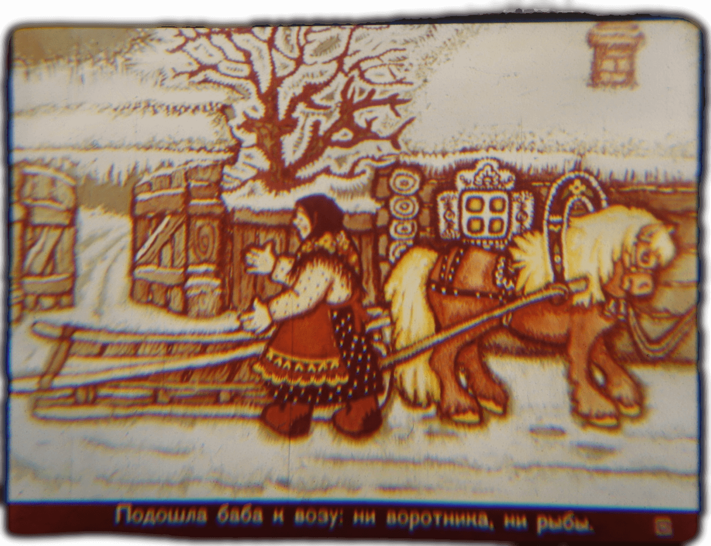
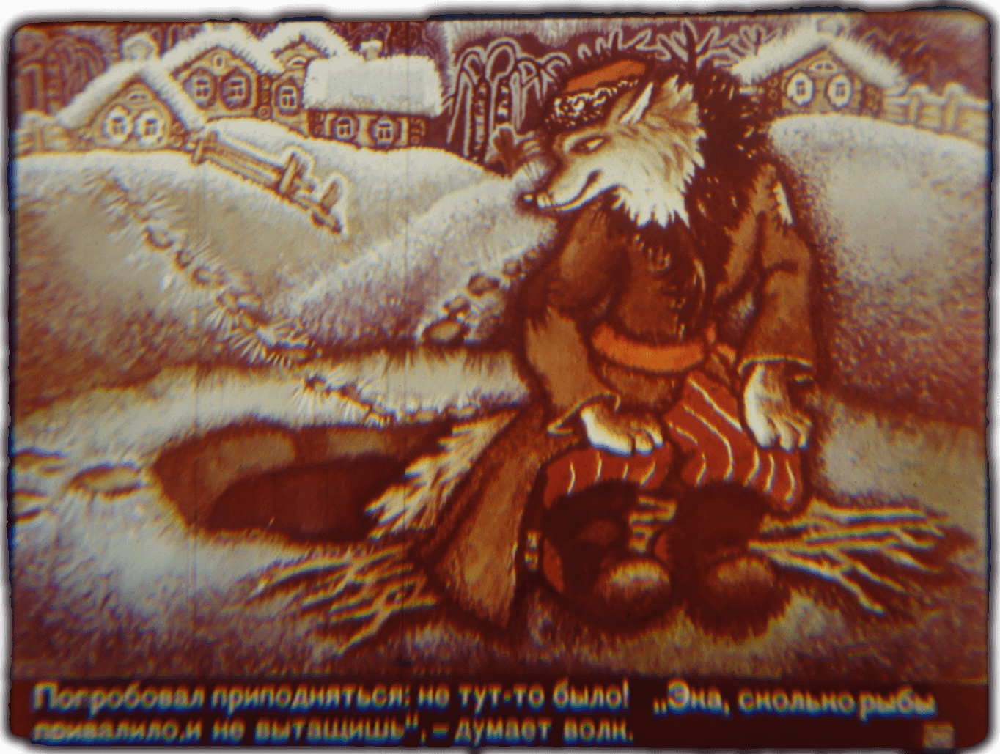
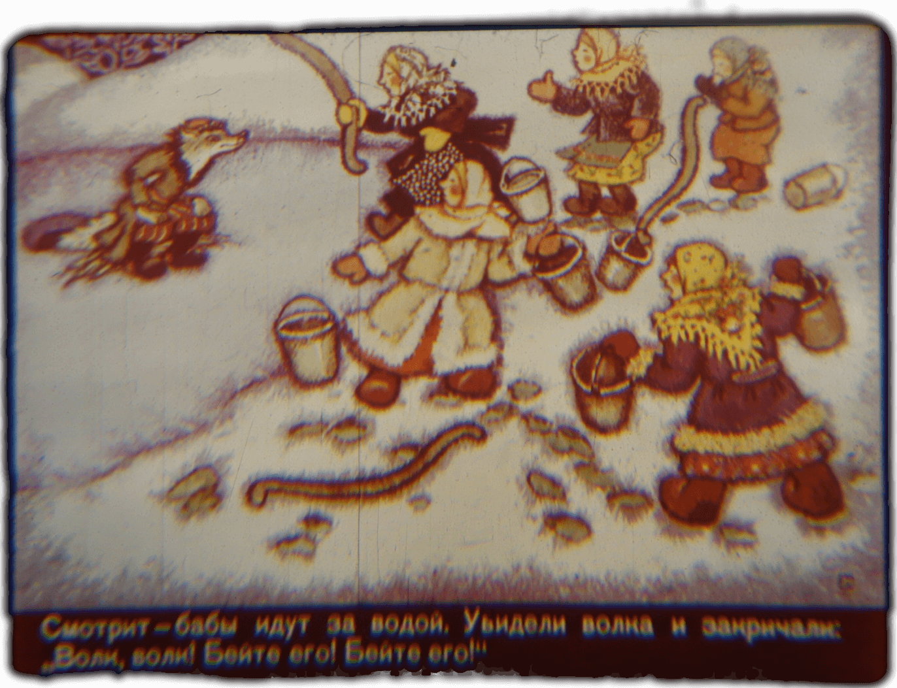
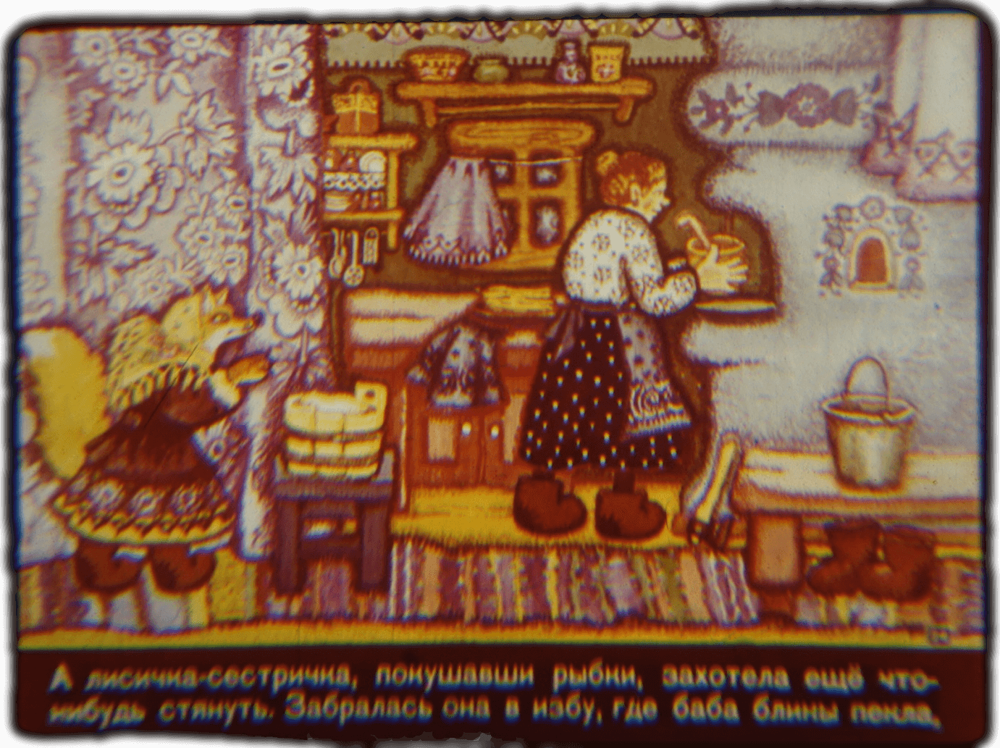
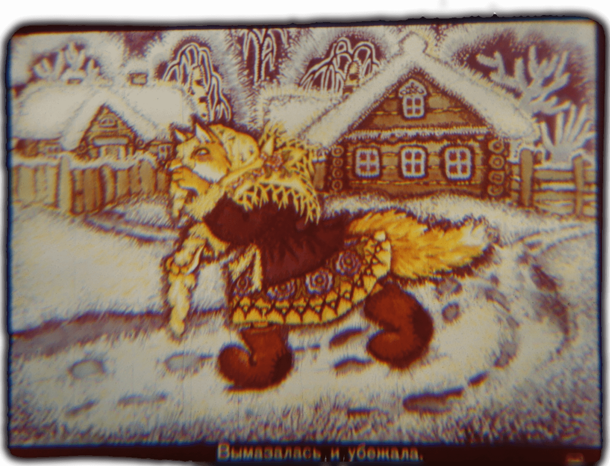
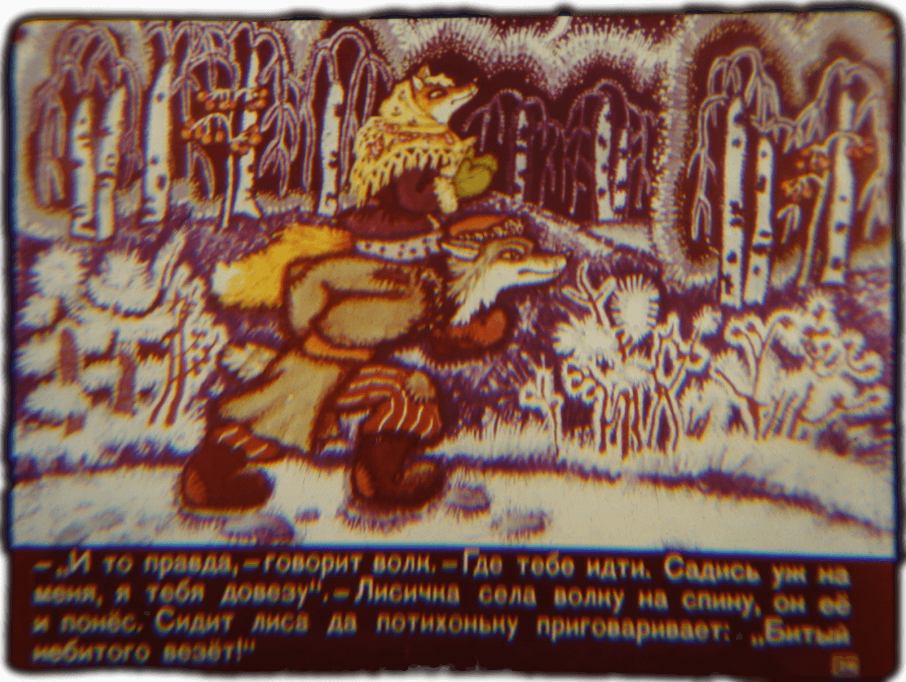
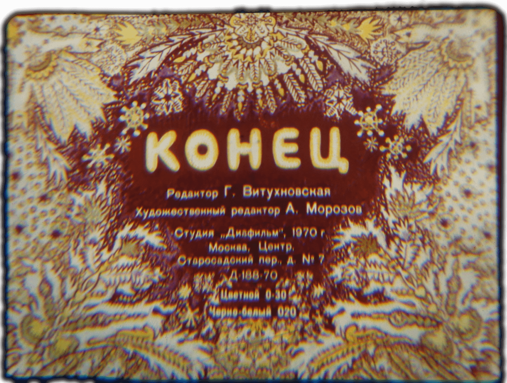
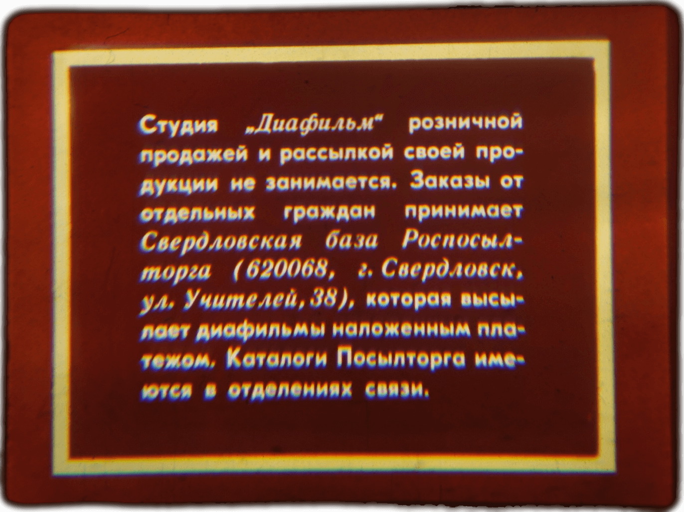

<!--
author:   André Dietrich

email:    LiaScript@web.de

version:  0.0.1

language: de

mode:     Presentation

dark:     true

narrator: Deutsch Female

link:     https://cdnjs.cloudflare.com/ajax/libs/animate.css/3.7.2/animate.min.css

translation: Russisch README.md

-->

# Schwesterchen Fuchs und der graue Wolf

    {{1-2}}
<!--
style="width: calc(100vmin - 60px)"
class="animated fadeInDown" -->

    {{2-3}}
<!--
style="width: calc(100vmin - 60px)"
class="animated fadeInDown" -->

    {{3-4}}
<!--
style="width: calc(100vmin - 60px)"
class="animated fadeInDown" -->

    {{4-5}}
<!--
style="width: calc(100vmin - 60px)"
class="animated fadeInDown" -->

    {{5-6}}
<!--
style="width: calc(100vmin - 60px)"
class="animated fadeInDown" -->

    --{{5}}--
Schwesterchen Fuchs und der graue Wolf

    {{6-7}}
<!--
style="width: calc(100vmin - 60px)"
class="animated fadeInDown" -->

    --{{6}}--
Es hungerte die Füchsin. Sie läuft auf der Straße und schaut: ob es nicht
möglich ist etwas zu ergattern.

    {{7-8}}
<!--
style="width: calc(100vmin - 60px)"
class="animated fadeInDown" -->

    --{{7}}--
Sie sieht - wie ein Mann auf einem Schlitten gefrorenen Fisch transportiert.

    {{8-9}}
<!--
style="width: calc(100vmin - 60px)"
class="animated fadeInDown" -->

    --{{8}}--
Die Füchsin rannte schnell voran, legte sich auf die Straße, warf den Schwanz
von sich und streckte die Beine aus ...  na, tot, und nun!

    {{9-10}}
<!--
style="width: calc(100vmin - 60px)"
class="animated fadeInDown" -->

    --{{9}}--
Der Mann fuhr heran, sah auf die Füchsin und sagte: "Herrlich, das wird ein
schöner Kragen für den Pelzmantel meiner Frau."

    {{10-11}}
<!--
style="width: calc(100vmin - 60px)"
class="animated fadeInDown" -->

    --{{10}}--
Der Mann nahm die Füchsin beim Schwanz und warf sie in den Schlitten.

    {{11-12}}
<!--
style="width: calc(100vmin - 60px)"
class="animated fadeInDown" -->

    --{{11}}--
Nicht lange hat die Füchsin gelegen: sie machte ein Loch in den Sack und begann
den Fisch vom Schlitten zu werfen.

    {{12-13}}
<!--
style="width: calc(100vmin - 60px)"
class="animated fadeInDown" -->

    --{{12}}--
Fisch um Fisch, Fisch um Fisch - alles warf sie heraus.

    {{13-14}}
<!--
style="width: calc(100vmin - 60px)"
class="animated fadeInDown" -->

    --{{13}}--
Und dann stieg sie selber vom Schlitten.

    {{14-15}}
<!--
style="width: calc(100vmin - 60px)"
class="animated fadeInDown" -->

    --{{14}}--
Da kam der Mann nach Hause und sagte: Na, Alte, schau nur was für einen Kragen
ich dir für deinen Pelzmantel mitgebracht habe!

    {{15-16}}
<!--
style="width: calc(100vmin - 60px)"
class="animated fadeInDown" -->

    --{{15}}--
Da ging das Weib zum Wagen: kein Kragen, keinen Fisch.

    {{16-17}}
<!--
style="width: calc(100vmin - 60px)"
class="animated fadeInDown" -->

    --{{16}}--
Da verstand der Alte, dass die Füchsin nicht tot gewesen war, er grübelte und
grübelte  aber machen konnte er nichts.

    {{17-18}}
<!--
style="width: calc(100vmin - 60px)"
class="animated fadeInDown" -->

    --{{17}}--
Die Füchsin brachte all den Fisch zu ihrem Bau, setzte sich und begann den Fisch
zu essen.

    {{18-19}}
<!--
style="width: calc(100vmin - 60px)"
class="animated fadeInDown" -->

    --{{18}}--
Da sieht die Füchsin den Wolf. Vor hunger ist sein Gesicht schon ganz
eingefallen.

    {{19-20}}
<!--
style="width: calc(100vmin - 60px)"
class="animated fadeInDown" -->

    --{{19}}--
"Grüß dich, Schwesterchen!" - "Grüß dich, Brüderchen." - "Was isst du?" -
"Fisch." - "Überlass mir doch nur einen!"

    {{20-21}}
<!--
style="width: calc(100vmin - 60px)"
class="animated fadeInDown" -->

    --{{20}}--
"Geh und fang dir selber welche, dann kannst du auch essen." - "Ich weiß nicht
wie das geht." - "Sogar ich habe Fisch fangen können."

    {{21-22}}
<!--
style="width: calc(100vmin - 60px)"
class="animated fadeInDown" -->

    --{{21}}--
Geh zum Fluß, lass deinen Schwanz in ein Eisloch hängen, setz dich hin und
sprich: "Lass dich fangen Fisch ob klein ob groß". Die Fische hängen sich dann
von selbst bei dir an den Schwanz. Aber achte darauf etwas länger zu sitzen,
sonst fängst du keinen Fisch.

    {{22-23}}
<!--
style="width: calc(100vmin - 60px)"
class="animated fadeInDown" -->

    --{{22}}--
Der Wolf tat, wie ihm aufgetragen wurde. Er sitzt und spricht: "Lass dich fangen
Fisch ob klein ob groß. Lass dich fangen Fisch ob klein ob groß."

    {{23-24}}
<!--
style="width: calc(100vmin - 60px)"
class="animated fadeInDown" -->

    --{{23}}--
Lange saß der Wolf beim Eisloch - die ganze Nacht bewegte er sich nicht von der
Stelle. Sein Schwanz war sogar schon eingefroren.

    {{24-25}}
<!--
style="width: calc(100vmin - 60px)"
class="animated fadeInDown" -->

    --{{24}}--
Er versuchte aufzustehen aber es klappte nicht. Wieviel Fisch habe ich da
gefangen und kann ihn nicht an Land ziehen, dachte der Wolf.

    {{25-26}}
<!--
style="width: calc(100vmin - 60px)"
class="animated fadeInDown" -->

    --{{25}}--
Da sieht der Wolf, wie die Frauen Wasser holen gehen. Die Frauen erblickten den
Wolf und fingen an zu schreien: "Ein Wolf, ein Wolf! Schlagt ihn! Schlagt ihn!".

    {{26-27}}
<!--
style="width: calc(100vmin - 60px)"
class="animated fadeInDown" -->

    --{{26}}--
Die Frauen kamen gerannt und begannen auf den Wolf einzuschlagen, manche mit
einem Joch, andere mit einem Eimer. Der Wolf sprang auf, riss sich den Schwanz
ab und rannte davon, ohne sich einmal umzudrehen.

    {{27-28}}
<!--
style="width: calc(100vmin - 60px)"
class="animated fadeInDown" -->

    --{{27}}--
Na gut, - dachte der Wolf -, das zahle ich dir zurück, Füchslein.

    {{28-29}}
<!--
style="width: calc(100vmin - 60px)"
class="animated fadeInDown" -->

    --{{28}}--
Als Schwesterchen Fuchs den Fisch aufgegessen hatte, wollte sie noch etwas
anderes. Sie schlich sich in eine Hütte, in der eine Frau Pfannkuchen backte.

    {{29-30}}
<!--
style="width: calc(100vmin - 60px)"
class="animated fadeInDown" -->

    --{{29}}--
Sie traf mit dem Kopf auf den Boden mit dem Teig.

    {{30-31}}
<!--
style="width: calc(100vmin - 60px)"
class="animated fadeInDown" -->

    --{{30}}--
Sie machte sich kurz sauber und rannte weg.

    {{31-32}}
<!--
style="width: calc(100vmin - 60px)"
class="animated fadeInDown" -->

    --{{31}}--
Sie rennt weg und der Wolf kommt ihr entgegen. Was lehrst du mich, Füchsin! Man
hat mich  ganz durchgeprügelt.

    {{32-33}}
<!--
style="width: calc(100vmin - 60px)"
class="animated fadeInDown" -->

    --{{32}}--
Ach, sagte Schwesterchen Fuchs. Du hast nur deinen Schwanz verloren, aber ich
mir wurde Schädel gebrochen. Schau, mir kommt sogar das Hirn aus dem Schädel.
Mir geht es schlechter als dir, ich kann mich kaum rühren.

    {{33-34}}
<!--
style="width: calc(100vmin - 60px)"
class="animated fadeInDown" -->

    --{{33}}--
Du hast recht, sagt der Wolf. Wohin gehst du? Setz dich auf mich, ich werde dich
tragen.  Die kleine Fuchsin setzte sich auf dem Rücken des Wolfes und er trug
sie.  Der Fuchs sitzt und beginnt langsam zu sprechen: "Dem Ungeschlagenen geht
es gut!"

    {{34-35}}
<!--
style="width: calc(100vmin - 60px)"
class="animated fadeInDown" -->

    --{{34}}--
Ende

      {{35}}
<!--
style="width: calc(100vmin - 60px)"
class="animated fadeInDown" -->

    --{{35}}--
Студиа "Диафилм" розничной продажей и рассылкой своей продукции не занимается.
Заказы от отдельных граждан принимает Свердловская база ...
