<!--
author:   Your Name

email:    your@mail.org

version:  0.0.1

language: en

narrator: Russian Female

comment:  Try to write a short comment about
          your course, multiline is also okay.

link:     https://cdn.jsdelivr.net/chartist.js/latest/chartist.min.css

script:   https://cdn.jsdelivr.net/chartist.js/latest/chartist.min.js

translation: Deutsch  translations/German.md

translation: Français translations/French.md
-->

# Лисичка-Сестричка и серын Волк

    {{1-2}}
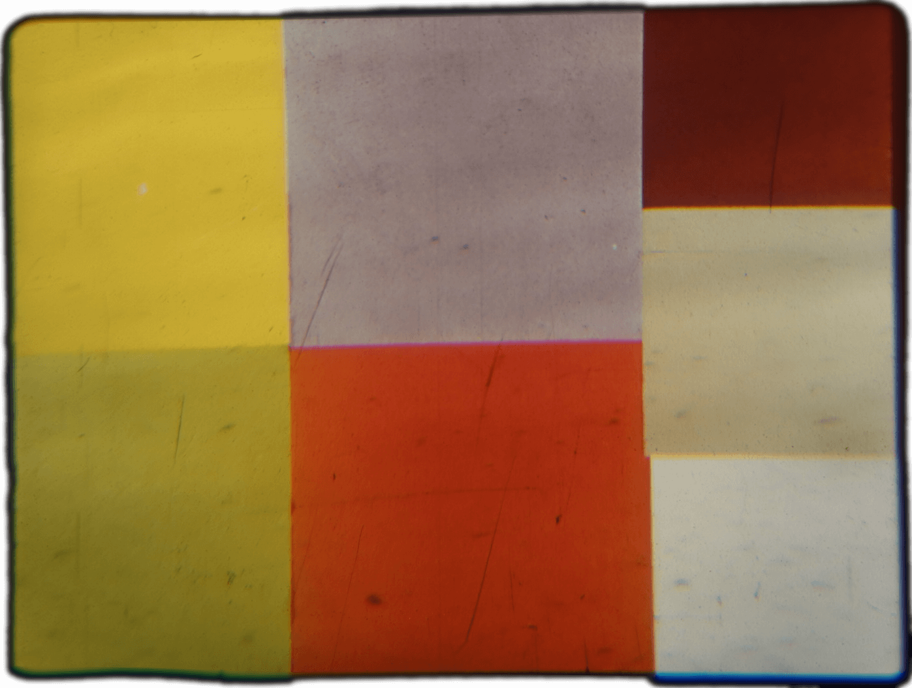<!-- style="width: 100%" -->

    {{2-3}}
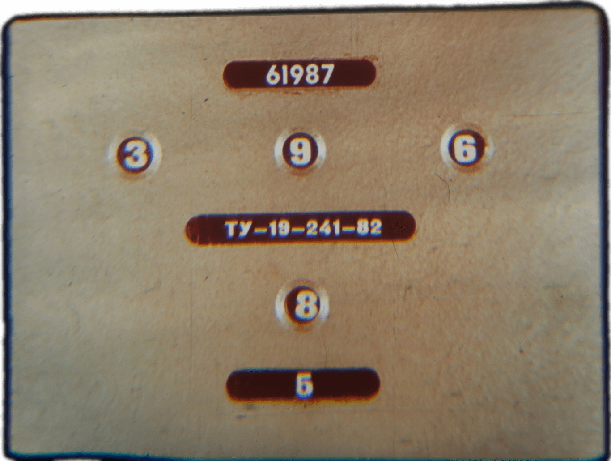<!-- style="width: 100%" -->

    {{3-4}}
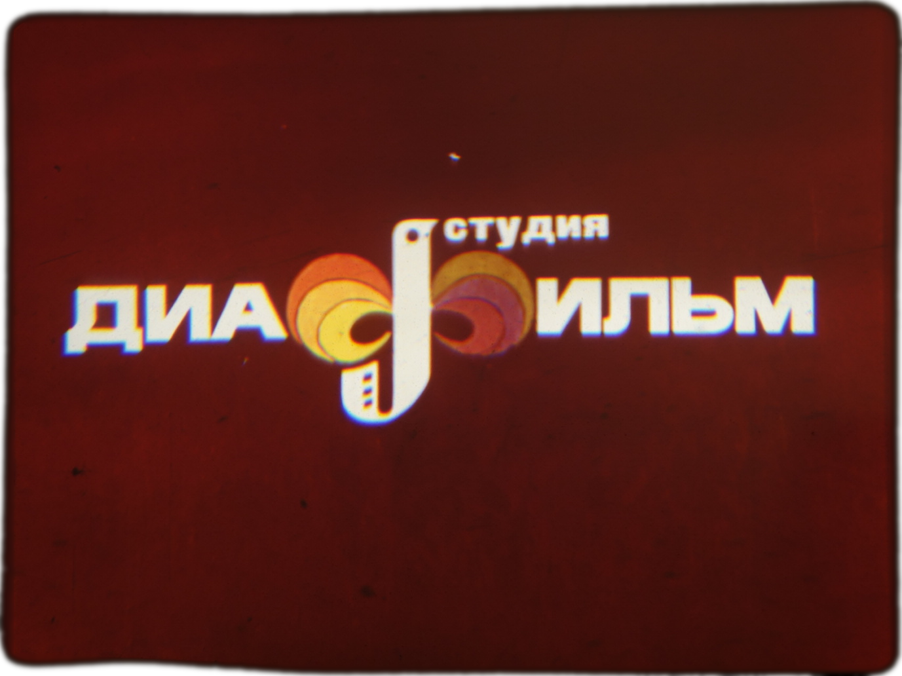<!-- style="width: 100%" -->

    {{4-5}}
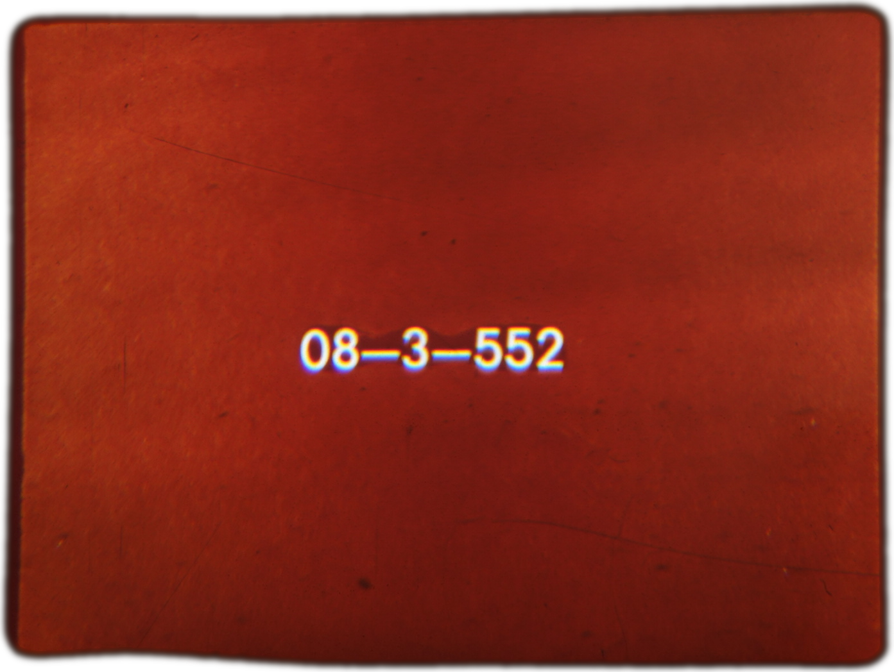<!-- style="width: 100%" -->

    {{5-6}}
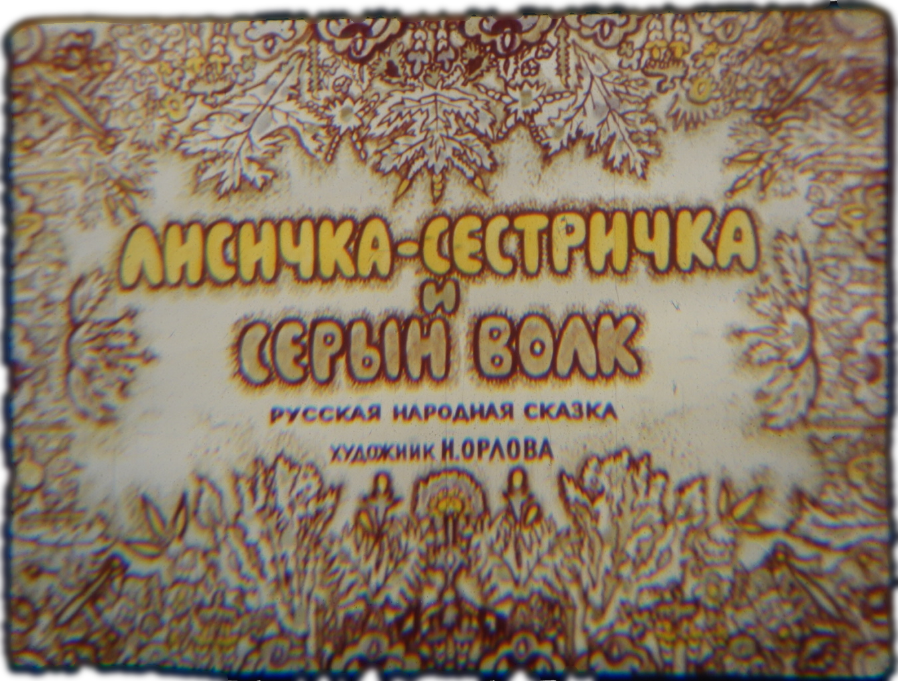<!-- style="width: 100%" -->

    --{{5}}--
Лисичка-Сестричка и серын Волк

    {{6-7}}
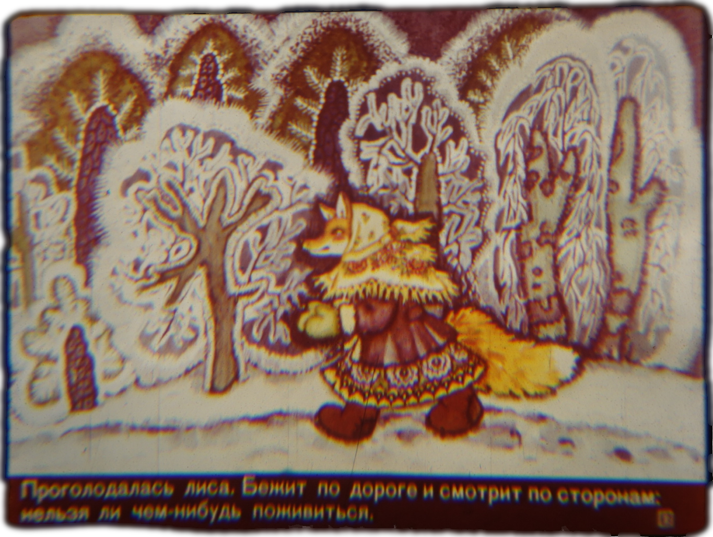<!-- style="width: 100%" -->

    --{{6}}--
Проголодалась лиса. Бежит по дороге и смотрит по сторонам: нельзя ли чем-нибудь
поживиться.

    {{7-8}}
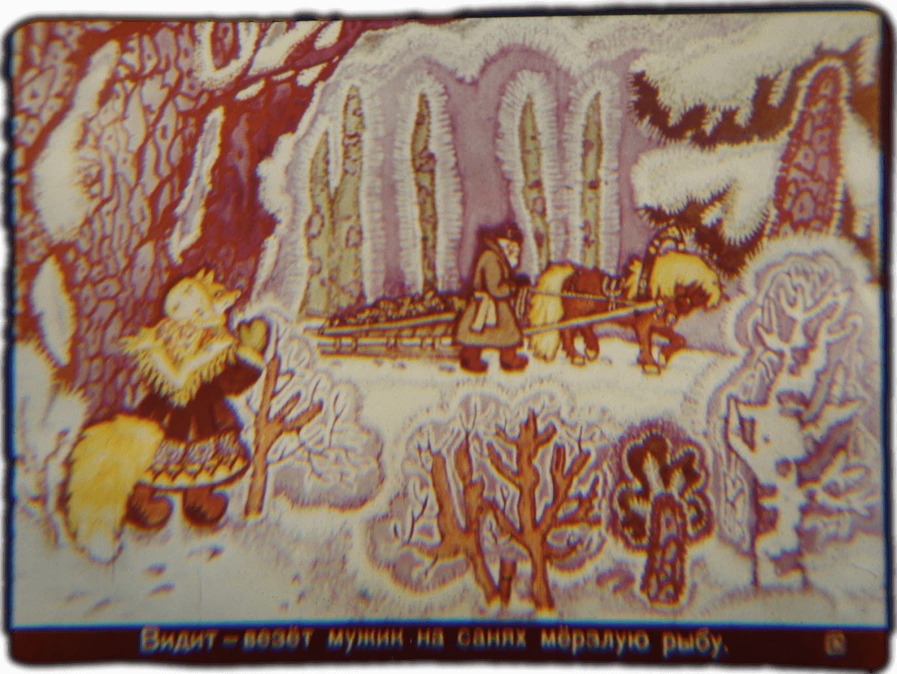<!-- style="width: 100%" -->

    --{{7}}--
Видит - везёт мужик на санях мёрзлую рыбу.

    {{8-9}}
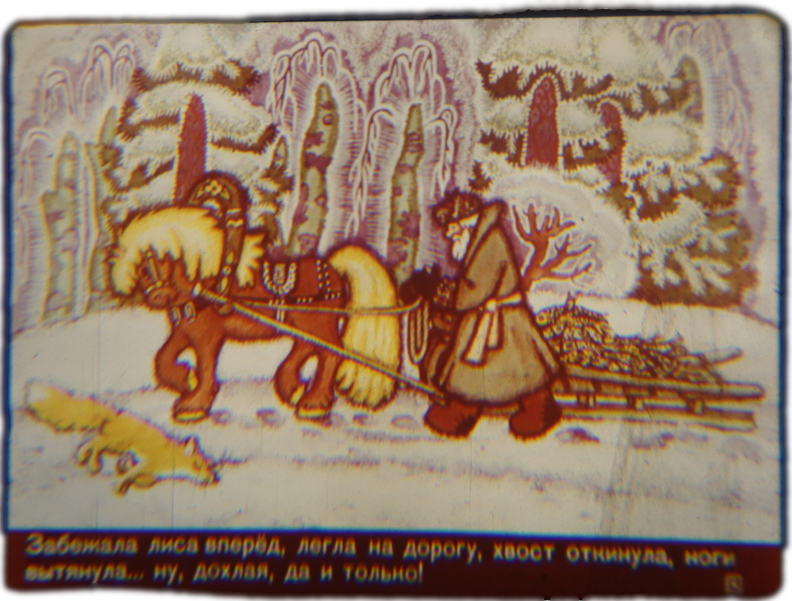<!-- style="width: 100%" -->

    --{{8}}--
Забежала лиса вперёд, легла на дорогу, хвост откинула, ноги вытянула... ну,
дохлая, дa и только!

    {{9-10}}
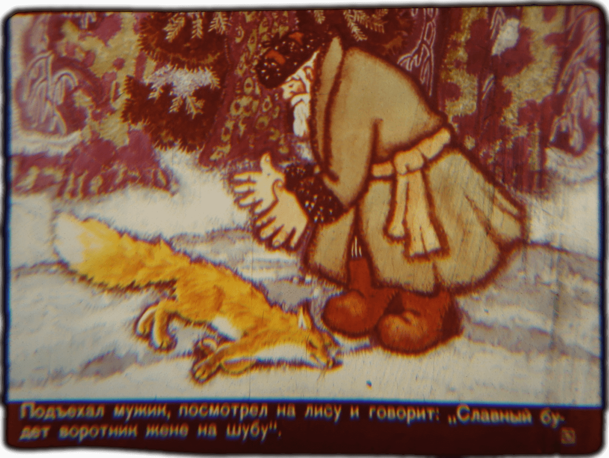<!-- style="width: 100%" -->

    --{{9}}--
Подъехал мужик, посмотрел на лису и говорит: "Славный будет воротник жене на
шубу".

    {{10-11}}
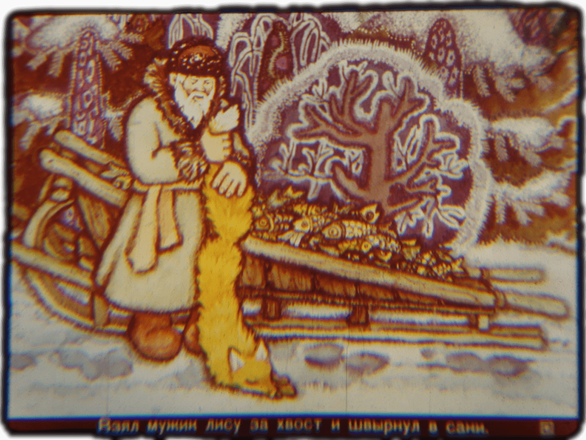<!-- style="width: 100%" -->

    --{{10}}--
Взял мужик лису за хвост и швырнул в сани.

    {{11-12}}
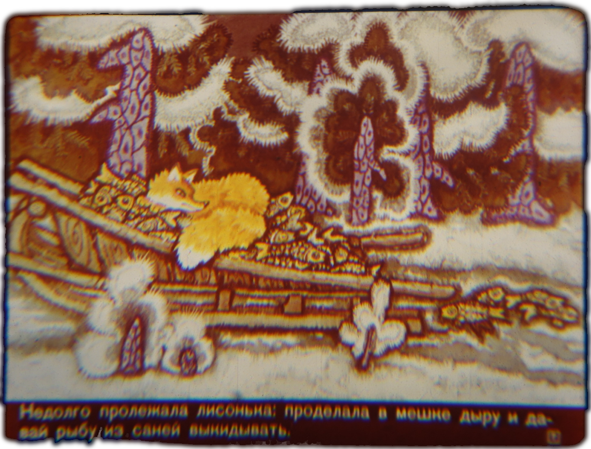<!-- style="width: 100%" -->

    --{{11}}--
Недолго пролежала лисонька: проделала в межке дыру и давай рыбу саней
выкидывать.

    {{12-13}}
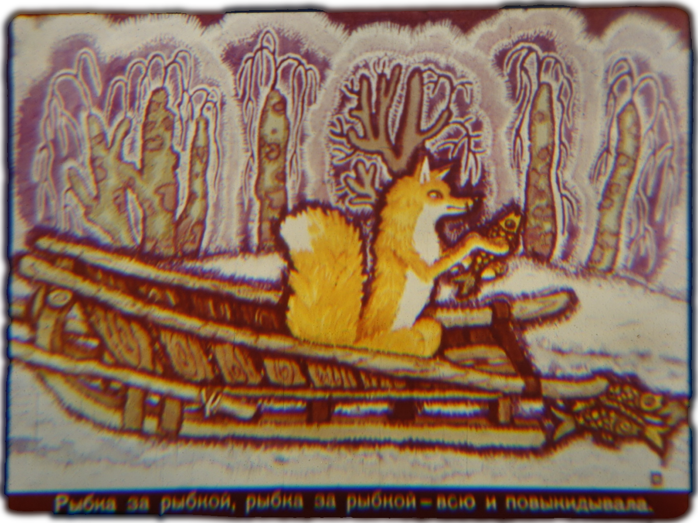<!-- style="width: 100%" -->

    --{{12}}--
Рыбка за рыбкой, рыбка за рыбкой - бсю и повыкидывала.

    {{13-14}}
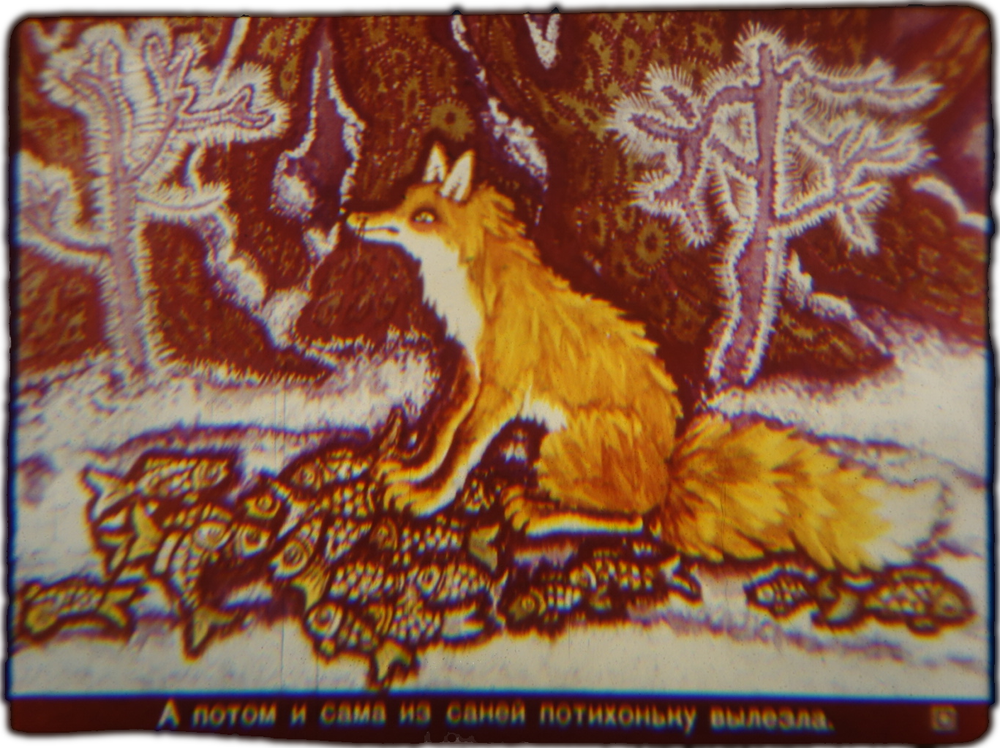<!-- style="width: 100%" -->

    --{{13}}--
А потом и сама из саней потихоньку вылезла.
