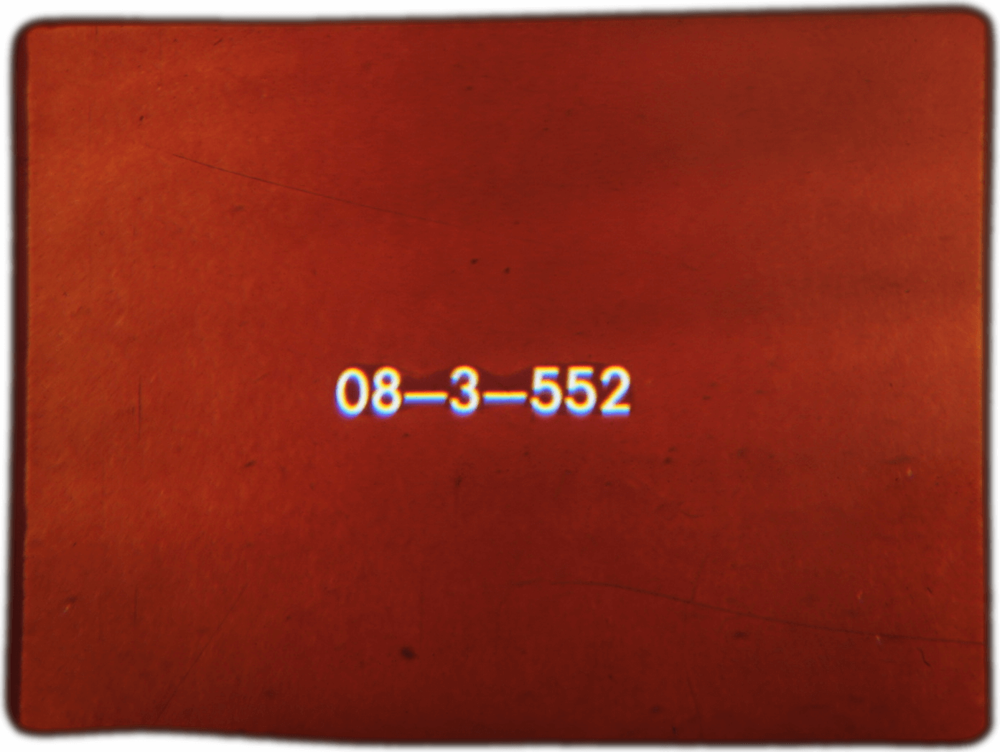
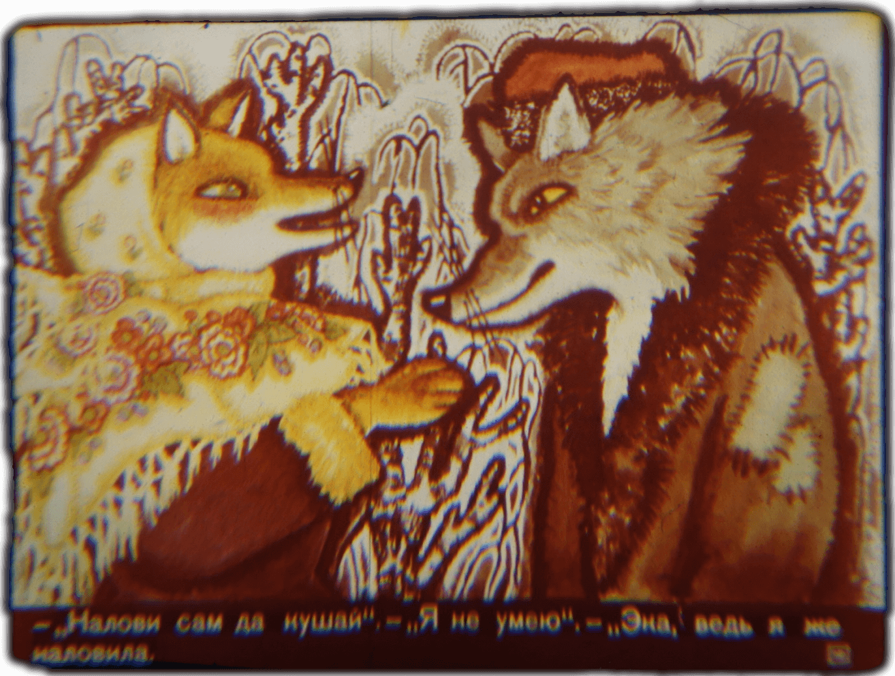
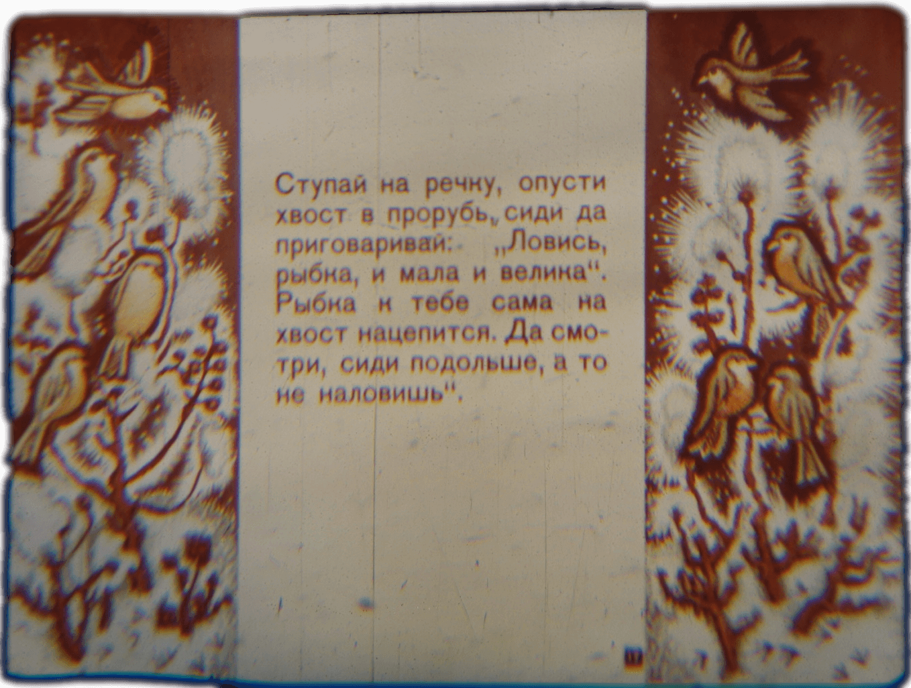
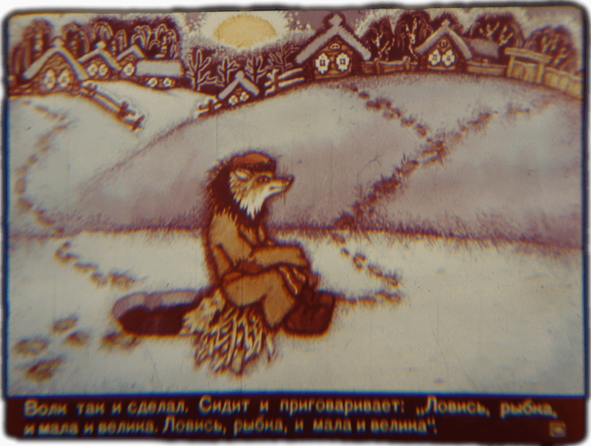
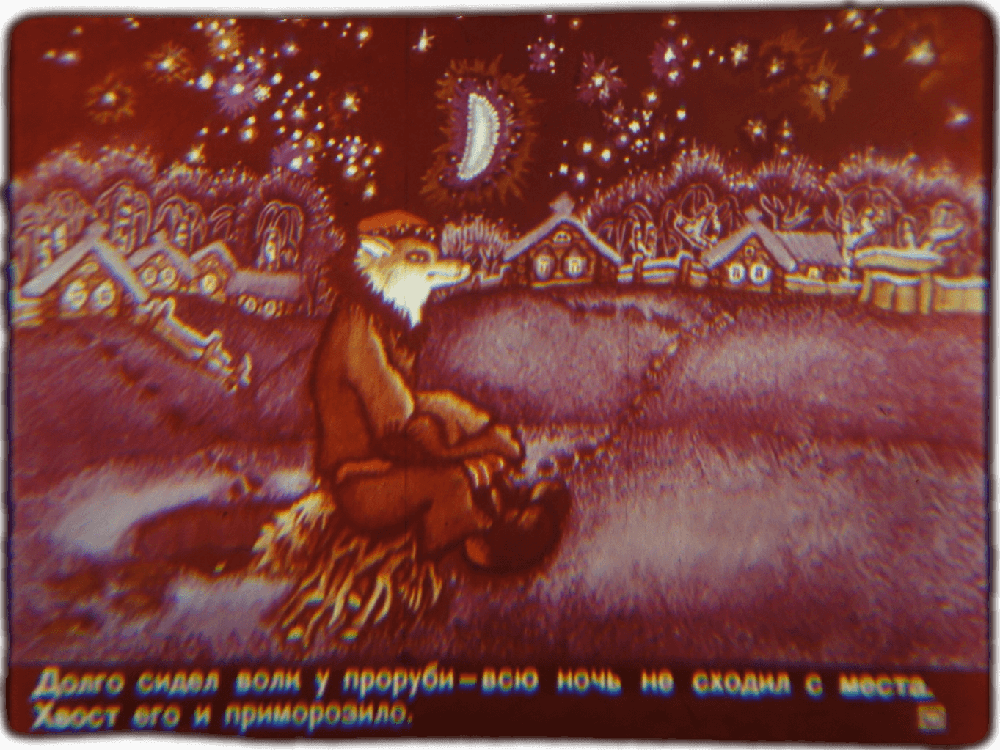
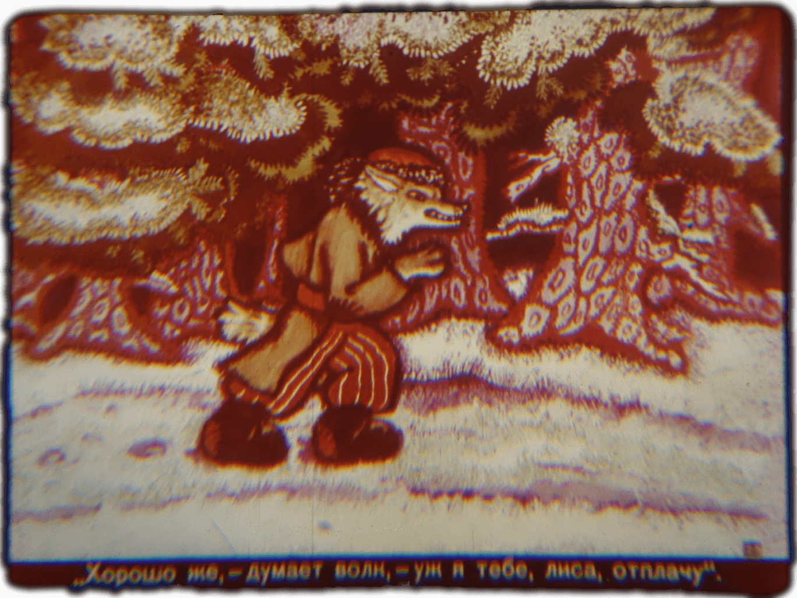

<!--
author:   André Dietrich

email:    LiaScript@web.de

version:  0.0.1

language: en

mode:     Presentation

dark:     true

narrator: Russian Female

link:     https://cdnjs.cloudflare.com/ajax/libs/animate.css/3.7.2/animate.min.css

translation: Deutsch  translations/German.md

-->

# Лисичка-Сестричка и серын Волк

    {{1-2}}
<!--
style="width: 100%; max-width: 800px"
class="animated fadeInDown" -->

    {{2-3}}
<!--
style="width: 100%; max-width: 800px"
class="animated fadeInDown" -->

    {{3-4}}
<!--
style="width: 100%; max-width: 800px"
class="animated fadeInDown" -->

    {{4-5}}
<!--
style="width: 100%; max-width: 800px"
class="animated fadeInDown" -->

    {{5-6}}
<!--
style="width: 100%; max-width: 800px"
class="animated fadeInDown" -->

    --{{5}}--
Лисичка-Сестричка и серын Волк

    {{6-7}}
<!--
style="width: 100%; max-width: 800px"
class="animated fadeInDown" -->

    --{{6}}--
Проголодалась лиса. Бежит по дороге и смотрит по сторонам: нельзя ли чем-нибудь
поживиться.

    {{7-8}}
<!--
style="width: 100%; max-width: 800px"
class="animated fadeInDown" -->

    --{{7}}--
Видит - везёт мужик на санях мёрзлую рыбу.

    {{8-9}}
<!--
style="width: 100%; max-width: 800px"
class="animated fadeInDown" -->

    --{{8}}--
Забежала лиса вперёд, легла на дорогу, хвост откинула, ноги вытянула... ну,
дохлая, дa и только!

    {{9-10}}
<!--
style="width: 100%; max-width: 800px"
class="animated fadeInDown" -->

    --{{9}}--
Подъехал мужик, посмотрел на лису и говорит: "Славный будет воротник жене на
шубу".

    {{10-11}}
<!--
style="width: 100%; max-width: 800px"
class="animated fadeInDown" -->

    --{{10}}--
Взял мужик лису за хвост и швырнул в сани.

    {{11-12}}
<!--
style="width: 100%; max-width: 800px"
class="animated fadeInDown" -->

    --{{11}}--
Недолго пролежала лисонька: проделала в межке дыру и давай рыбу саней
выкидывать.

    {{12-13}}
<!--
style="width: 100%; max-width: 800px"
class="animated fadeInDown" -->

    --{{12}}--
Рыбка за рыбкой, рыбка за рыбкой - бсю и повыкидывала.

    {{13-14}}
<!--
style="width: 100%; max-width: 800px"
class="animated fadeInDown" -->

    --{{13}}--
А потом и сама из саней потихоньку вылезла.

    {{14-15}}
<!--
style="width: 100%; max-width: 800px"
class="animated fadeInDown" -->

    --{{14}}--
Приехал мужик домой. - "Ну, старуха, - говорит он, - какой воротник привёз я
тебе на жубу!"

    {{15-16}}
<!--
style="width: 100%; max-width: 800px"
class="animated fadeInDown" -->

    --{{15}}--
Подошла баба к возу: ни воротника, ни рыбы.

    {{16-17}}
<!--
style="width: 100%; max-width: 800px"
class="animated fadeInDown" -->

    --{{16}}--
Тут дед смекнул, что лисичка-то была не мёртвая, погоревал, погоревал, да делать
нечего.

    {{17-18}}
<!--
style="width: 100%; max-width: 800px"
class="animated fadeInDown" -->

    --{{17}}--
А лиса перетаскала всю рыбу к себе в нору, села у норы и рибку кушает.

    {{18-19}}
<!--
style="width: 100%; max-width: 800px"
class="animated fadeInDown" -->

    --{{18}}--
Видит лиса - бежит волк. От голода у него бока подвело.

    {{19-20}}
<!--
style="width: 100%; max-width: 800px"
class="animated fadeInDown" -->

    --{{19}}--
- "Здравствуй, сестрица!" - "Сдравствуй, братец". - "Что кушаешь?" - "Рыбку". -
"Дай мне хоть одну".

    {{20-21}}
<!--
style="width: 100%; max-width: 800px"
class="animated fadeInDown" -->

    --{{20}}--
- "Налови сам да кушай". - "Я не умею". - "Эна, ведь я же наловила".

    {{21-22}}
<!--
style="width: 100%; max-width: 800px"
class="animated fadeInDown" -->

    --{{21}}--
Ступай на реку, опусти хвост в прорубь, сиди да приговаривай: "Ловось, рыбка, и
мала и велика". Рыбка к тебе сама на хвост нацепится. Да смотри, сиди подольше,
а то не наловишь.

    {{22-23}}
<!--
style="width: 100%; max-width: 800px"
class="animated fadeInDown" -->

    --{{22}}--
Волк так и сделал. Сидит и приговаривает: "Ловось, рыбка, и мала и велика.
Ловось, рыбка, и мала и велика".

    {{23-24}}
<!--
style="width: 100%; max-width: 800px"
class="animated fadeInDown" -->

    --{{23}}--
Долго сидел волк у проруби - всю ночь не сходил с места. Хвост его и
приморозило.

    {{24-25}}
<!--
style="width: 100%; max-width: 800px"
class="animated fadeInDown" -->

    --{{24}}--
Попробовал приподняться: не тут-то било! "Эта, сколько рыбы привалило, и не
вытащишь", думает волк.

    {{25-26}}
<!--
style="width: 100%; max-width: 800px"
class="animated fadeInDown" -->

    --{{25}}--
Смотрит - бабы идут за водой. Уьидели волка и закричали: "Волк, волк! Бейте его!
Бейте его!"

    {{26-27}}
<!--
style="width: 100%; max-width: 800px"
class="animated fadeInDown" -->

    --{{26}}--
Прибежали и начали колотить волка, кто коромыслом, кто ведром. Волк прыгал,
прыгал, оторвал себе хвост и пустился бежаты без оглядки.

    {{27-28}}
<!--
style="width: 100%; max-width: 800px"
class="animated fadeInDown" -->

    --{{27}}--
"Хорошо же, - думает волк, - уж я тебе, лиса, отплачу".

    {{28-29}}
<!--
style="width: 100%; max-width: 800px"
class="animated fadeInDown" -->

    --{{28}}--
А лисичка-сестричка, покушавши рыбки, захотела ещё чтонибудь стянуть. Забралась
она в избу, где баба блины пекла.

    {{29-30}}
<!--
style="width: 100%; max-width: 800px"
class="animated fadeInDown" -->

    --{{29}}--
Да попала головой в надну с тестом.

    {{30-31}}
<!--
style="width: 100%; max-width: 800px"
class="animated fadeInDown" -->

    --{{30}}--
Вымазалась и убежала.

    {{31-32}}
<!--
style="width: 100%; max-width: 800px"
class="animated fadeInDown" -->

    --{{31}}--
Бешит, а волк ей навстречу. - "Так-то ты учишь меня, лиса! Всего меня
исколотоли"

    {{32-33}}
<!--
style="width: 100%; max-width: 800px"
class="animated fadeInDown" -->

    --{{32}}--
- Эх, - говорит лисичка-сестричка, - у тебя хоть только хвост оторвали, а мне
голобу расшибили. Видишь - мозги вылезли. Мне больней твоего: еле плетусь.

    {{33-34}}
<!--
style="width: 100%; max-width: 800px"
class="animated fadeInDown" -->

    --{{33}}--
- "И то правда, - говорит волк. - Где тебе идти. Садись уж на меня, я тебя
довезу". - Лисичка села волку на спину, он её и понёс. Сидит лиса да потихоньку
приговаривает: "Битый небитого везёт!"

    {{34-35}}
<!--
style="width: 100%; max-width: 800px"
class="animated fadeInDown" -->

    --{{34}}--
Конец

      {{35}}
<!--
style="width: 100%; max-width: 800px"
class="animated fadeInDown" -->

    --{{35}}--
Студиа "Диафилм" розничной продажей и рассылкой своей продукции не занимается.
Заказы от отдельных граждан принимает Свердловская база ...
